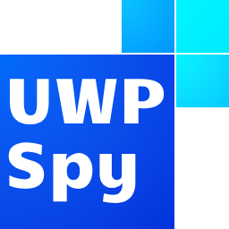
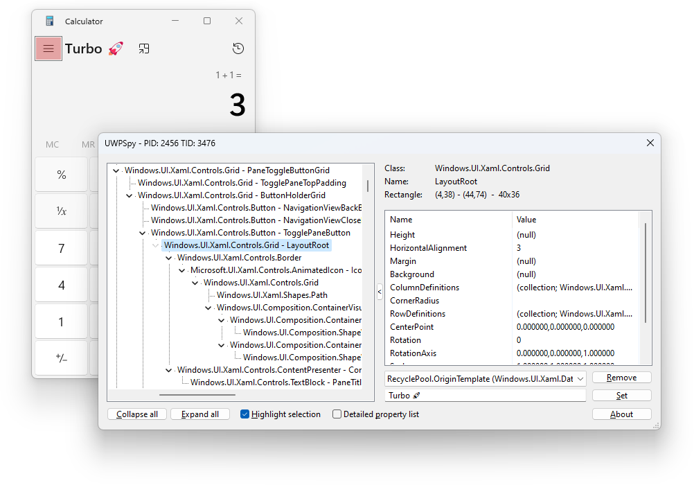
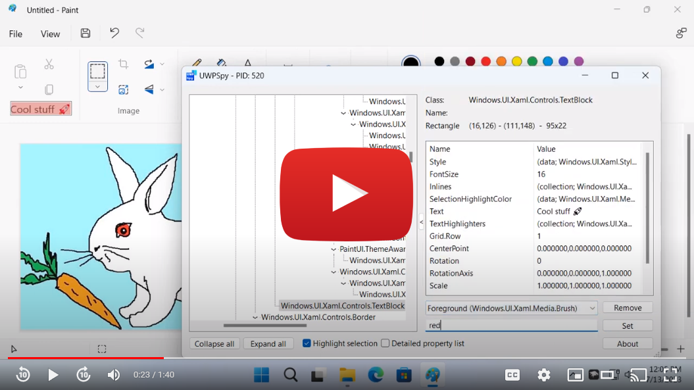

	
	<h1>UWPSpy</h1>

An inspection tool for UWP and WinUI 3 applications. Seamlessly view and
manipulate UI elements and their properties in real time.

[🏠 Homepage](https://ramensoftware.com/uwpspy)

## Usage

- Download the latest release from
  [here](https://ramensoftware.com/downloads/uwpspy.zip).
- Run **UWPSpy.exe** and select the UWP/WinUI 3 application you want to spy on.
- A window with the application's UI elements will appear for each UI thread of
  the target application.

## Demo

*Click on the image to view the demo video on YouTube.*

## Supported Windows versions

UWPSpy uses the [XAML Diagnostic
APIs](https://learn.microsoft.com/en-us/windows/win32/api/xamlom/nf-xamlom-initializexamldiagnosticsex)
which were added in Windows 10, version 1703. Earlier versions of Windows are
not supported.

## Dark mode support

UWPSpy supports dark mode on Windows 11 24H2 (build 26100.6899+) and 25H2 (build
26200.6899+). When the system dark mode setting is enabled, UWPSpy will
automatically use a dark theme.

To disable dark mode (e.g. if you use custom theming or encounter visual
issues), set the environment variable `UWPSPY_DISABLE_DARK_MODE=1` before
launching.

## References

- The
  [`ExplorerTAP`](https://github.com/TranslucentTB/TranslucentTB/tree/release/ExplorerTAP)
  part of the [TranslucentTB](https://github.com/TranslucentTB/TranslucentTB)
  project. That's the only usage example of the XAML Diagnostic APIs I could
  find on the internet.
- [Ahmed Walid (ahmed605)](https://github.com/ahmed605), thanks for helping with
  many UWP-related questions.
